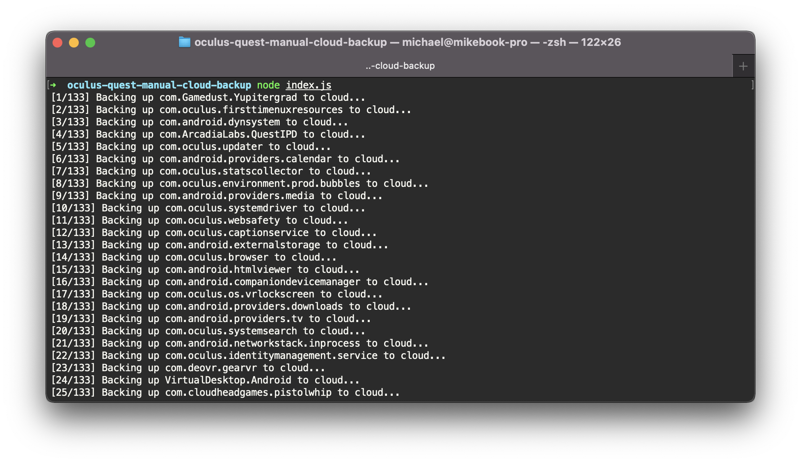

# oculus-quest-manual-cloud-backup

A simple script to perform a cloud backup (as added in Quest OS Build 35) for all supported Quest apps _now_. May be useful when you're planning to replace or upgrade your hardware and you want to make sure the cloud copy of your savegames and files is fully up-to-date.

Of course there is no guarantee on things being backed up properly; make sure to check the cloud backup status after running the script to make sure it did what you wanted!

## Notes

No backups will be created for:

- System apps (even if they can be seen in the backup log; the tool tries backing up everything but only supported things will actually perform a backup)
- Apps that have no stored data (such as apps that you've never started)

## Instructions

1. Download this repository to your computer either as a zip or using git
1. Download and install [node.js LTS](https://nodejs.org/en/) if you don't have it installed already
2. Download and install the Android [SDK Platform Tools](https://developer.android.com/studio/releases/platform-tools)
3. Enable USB Debugging on your Quest, connect it and allow access in VR (this is a bit more involved but there are instructions for this online)
4. Open a terminal/cmd, `cd` to the directory in which you extracted the source files (this directory) and run: `node index.js` (you will see backup progress as it is performed)
5. Check the cloud backup status of your apps and games here: https://secure.oculus.com/my/cloud-backup/
